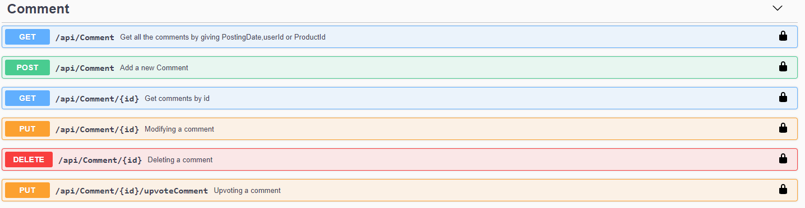
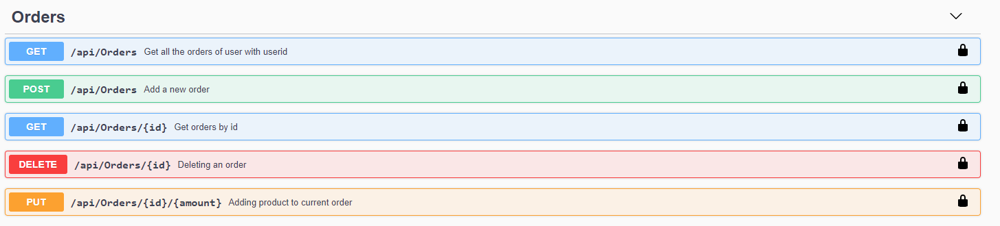
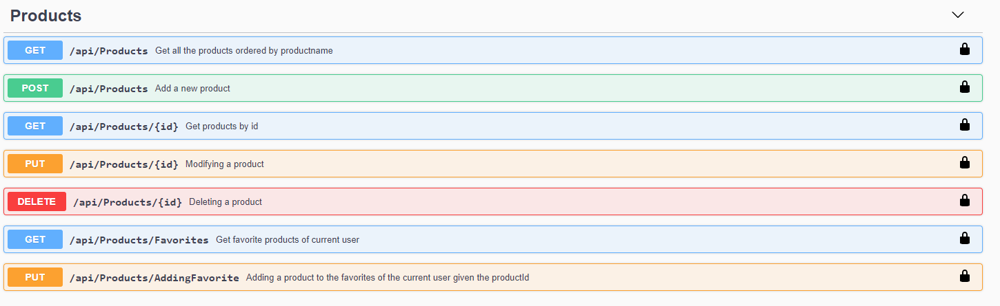
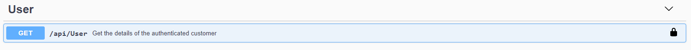

# Shopaholic Webshop

---

# Start the frontend


## How to
Use these commands in your  Terminal to clone the Back- and Front-End


```bash
~$ git clone https://github.com/Web-IV/2021-benjamin-gasthuysniek.git
~$ cd client/shopaholic
~$ npm start
```

Then open  http://localhost:4200/ in a browser


# Start the backend

## How to

Use the following commands in your  Terminal to navigate to the right folder and start the backend

```bash

~$ cd client/shopaholic
~$ cd ../../server/api
~$ dotnet run

```

### Printscreens Swagger
* Account controller


* Comment controller


* Order controller


* Product controller


* User controller
